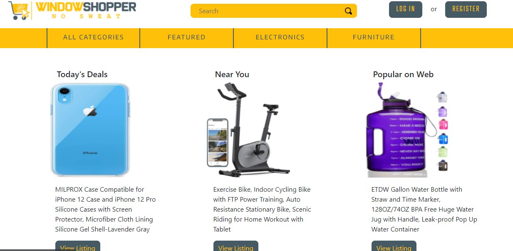
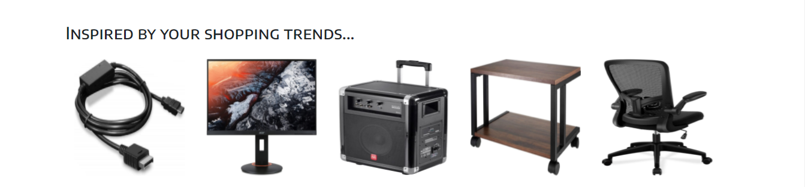

# Window Shopper
 
   

## Description

E-commerce website that allows visitors to view items for sale
Register users to post items to sell
Establish communication between the seller & buyer using built-in chat services and email.
View the deployed page at [Window shopper](https://project2-window-shopper.herokuapp.com).
  

## Contents
* [Usage](#Usage)
   * [Screenshots](#Screenshots)
* [Technologies](#Technologies)
* [Questions](#Questions)
* [Contributions](#Contributions)
* [Credits](#Credits)
   

## Usage
Use the "Login" link to login to an existing account or create a new account.  Logged in users can sell their products, can communicate with the seller and also buy a products they want from their Dashboard. Some products like today's deal, near to customer, and popular on web are available for the use.
  

### Screenshots
 
  

Logged in users can add a comment to a post.
  

<!-- 
Posts may also be edited or deleted.
   -->

## Technologies
* Node
* Express
* MySQL
* Sequelize
* Express Sessions
* Bcrypt
* Pug
  

## Questions
If you have any questions about the repo, please [open an issue](https://github.com/Gr0upFour/projectTwo/issues). You can find more of my work on my GitHub, [krutipatel](https://github.com/Gr0upFour/projectTwo/).
  

## Contributions
* Built with enthusiasm by Kruti Patel, Nayandeep Sidhu, Tony Huang, Sarah Azzopardi, Nemo.

## Credits
* [UofT Bootcamp](https://courses.bootcampspot.com/courses/)

